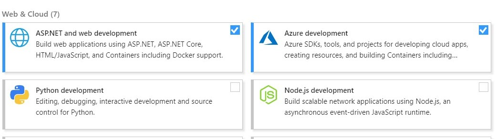

# Azure Functions & ARM

This project demonstrates Azure Function (v2) and automatic deployment using Azure ARM Templates. The demonstrated functionality is a port of `lbugnion's` [sample-azure-coinvalue](https://github.com/lbugnion/sample-azure-coinvalue) to the current Azure Functions runtime, as well as the inclusion of Azure Application Insights and custom metrics for Bitcoin and Ethereum prices.

## Prerequisites

Regardles of platform and IDE you will have to install the [.Net Core SDK](https://dotnet.microsoft.com/download) and the current [Azure Functions Core Tools](https://www.npmjs.com/package/azure-functions-core-tools). Which version of the SDK you need, depends on the version of function you want to develop: [Version overview](https://docs.microsoft.com/en-us/azure/azure-functions/functions-versions). *This project uses the 2nd version of Azure Functions.*

### Visual Studio Code

When using `Visual Studio Code` (which is my preferred way), you will need some extensions to work with Azure Functions and ARM templates. The ones I would recommend before getting started, are listed below:

- [Azure Account](https://marketplace.visualstudio.com/items?itemName=ms-vscode.azure-account) (required)
- [Azure Functions](https://marketplace.visualstudio.com/items?itemName=ms-azuretools.vscode-azurefunctions) (required)
- [Azure Storage](https://marketplace.visualstudio.com/items?itemName=ms-azuretools.vscode-azurestorage) (optional)
- [Azure Application Insights](https://marketplace.visualstudio.com/items?itemName=visualstudioonlineapplicationinsights.application-insights) (optional)
- [ARM Tools](https://marketplace.visualstudio.com/items?itemName=msazurermtools.azurerm-vscode-tools) (required)
- [ARM Template Viewer](https://marketplace.visualstudio.com/items?itemName=bencoleman.armview) (optional)

The ARM Template Viewer gives you a nice visualization of your deployment and is thus beneficial alongside the code during development of the template. The visualization for this project is given below:

### Visual Studio

When using `Visual Studio`, you will only need to make sure that you use the latest version (currently 2019) and have checked `ASP.NET and web development`, as well as `Azure development` during the installation process. If you have `Visual Studio` installed but have not used these SDKs as of yet, make sure to install them now.

If you want to make visualizations of your ARM template during development, as is possible in `Visual Studio Code`, you will need to use the [ARMVIZ visual designer](http://armviz.io/). Just upload your current progress there vis `File > Open Local Template ...`. It is also possible to develop your templates from therem, but the tradeof that has to be made is that templates created there can not be tested instantly.

## Run the demo

You can press the button above to automatically deploy the prepared ARM template in Azure. Alternatively make sure that you have the Azure Functions runtime installed, as well as the Azure storage emulator (only needed when only using `Visual Studio Code`), due to the fact that Functions rely heavily on Azure Storage Accounts.

> *If you want to have a look at the table this example populates and uses during runtime, make sure to have the [Azure Storage Explorer](https://azure.microsoft.com/en-us/features/storage-explorer/) installed.*

> *Important: The button above only deploys the infrastructure on Azure. You will need to push the code yourself!* In oder to push the code of the Azure Function use `Visual Studio Code` or `Visual Studio` with their respective methods for deploying to Azure.

### Running locally

#### Using an IDE

Open the project in your preferred IDE. I will use `Visual Studio Code` here, but following along in `Visual Studio` should be just as easy. You then can press `F5` to build and debug the function locally. The REST endpoint of the function will be available on <http://localhost:7071/api>. You can set breakpoints from here and dig into the code.

#### Using the console

This is also a completely valid method of running the app in a local environemt, if for example you want to use something like `Sublime Text`. In order to get started navigate to the project directory. Open up a terminal of your preference here and enter `dotnet restore` first, in order to grab all the latest packages from `nuget`. Once done you can complie the code using `dotnet build`. This results in a `CoinValue.dll` in `./bin/Debug/netcoreapp2.1/bin`. In order to run the function, navigate there and run `func host start CoinValue.dll`

### Deploying to Azure

If you want to publish the app to Azure you can do so by right clicking in either `Visual Studio Code` or `Visual Studio` and selecting either `Deploy to Function App ...` or `Deploy ...`. In any case a wizard will pop up, that helps you setting up the respective resources that are needed for deployment. Afterwards the code will be pushed to the respective resources and form there is ready to go. Once you made changes that you want to publish to Azure, simply rerun the steps above.

## Information

This Azure functions ever minutes takes a snapshot of the current Bitcoin and Ethereum prices from [CoinMarketCap](https://coinmarketcap.com/) and saves them to an Azure Table Storage. *Important: Do not use the one minute trigger in production, it will kill your Azure credit long term*. The latest price including information on whether the price is falling or rising, can then be retrieved via REST endpoints. The respective endpoint s are:

- **\[GET\]** - <http://localhost:7071/api/symbol>
- **\[GET\]** - <http://localhost:7071/api/symbol/{symbol}>

> Valid symbols are either **btc** or **eth**. But feel free to try others and produce unexpected behavior :smile:

## Usefull resources

### Azure Functions

- [Azure Functions documentation](https://docs.microsoft.com/en-us/azure/azure-functions/)
- [Functions C# Quick Start](https://docs.microsoft.com/en-us/azure/azure-functions/functions-create-your-first-function-visual-studio)
- [Connecting to Storage](https://docs.microsoft.com/en-us/azure/azure-functions/functions-add-output-binding-storage-queue-vs)

### Application Insights

- [Monitor Azure Functions](https://docs.microsoft.com/en-us/azure/azure-functions/functions-monitoring#enable-application-insights-integration)
- [Functions Application Insights package](https://www.nuget.org/packages/Microsoft.Azure.WebJobs.Logging.ApplicationInsights/)

### ARM Templates

- [ARM templates documentation](https://docs.microsoft.com/en-us/azure/azure-resource-manager/templates/)
- [ARM resources reference](https://docs.microsoft.com/en-us/azure/templates/)
- [ARM functions reference](https://docs.microsoft.com/en-us/azure/azure-resource-manager/templates/template-functions)
